<h1> Stock Trading Platform</h1>
A high-performance web application that replicates the core functionality of the Zerodha Kite platform. This project allows users to track real-time stock data, manage a portfolio, and execute simulated trades within a seamless, intuitive dashboard.

<h2>Screenshots :</h2>
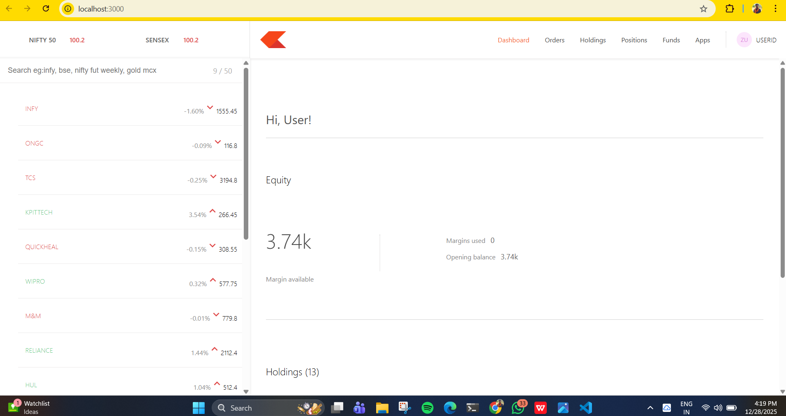
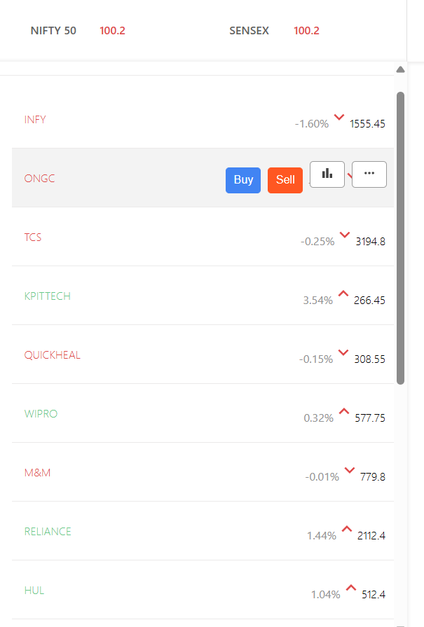
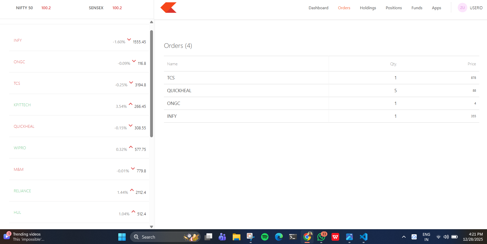
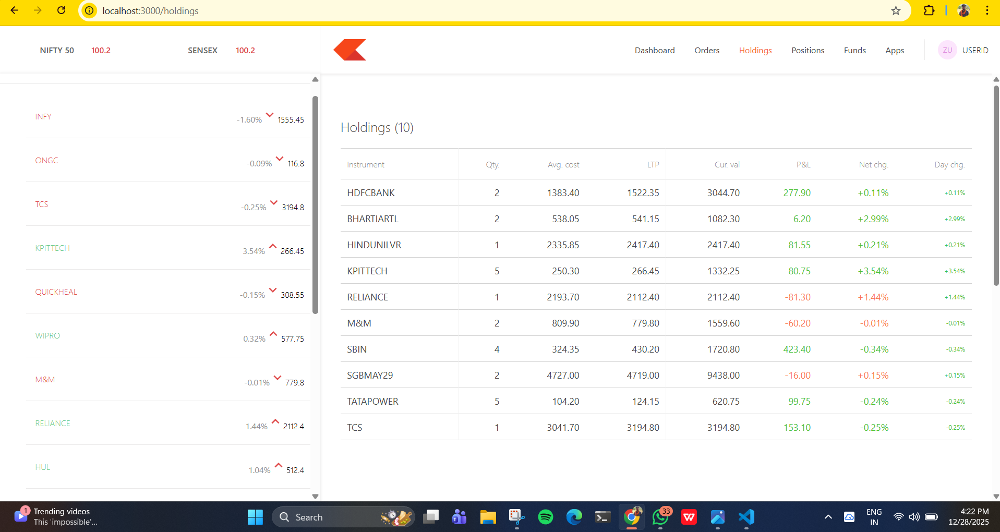
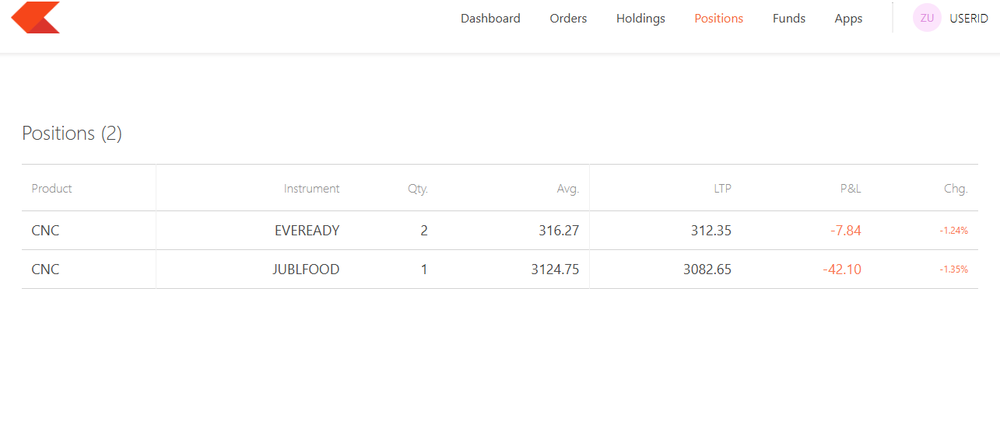
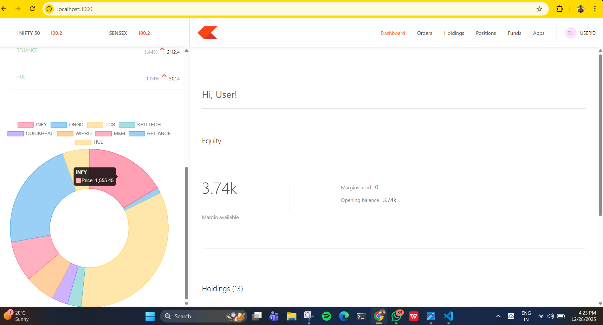
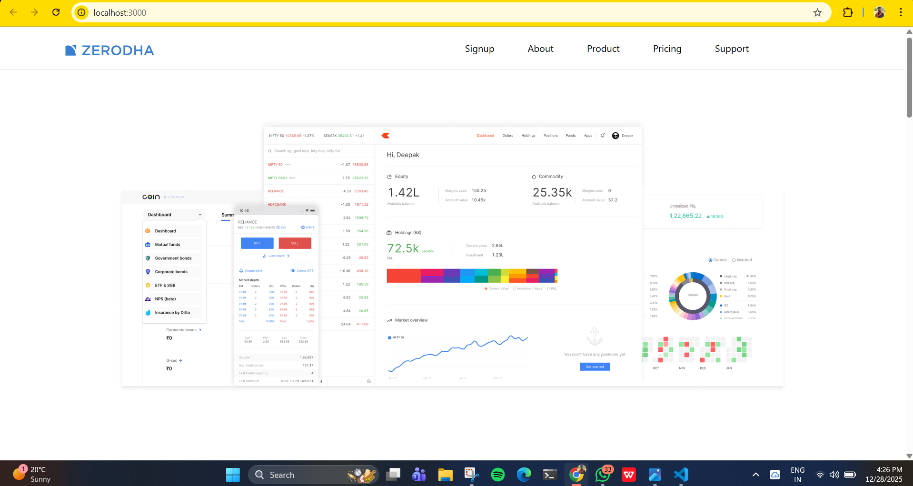
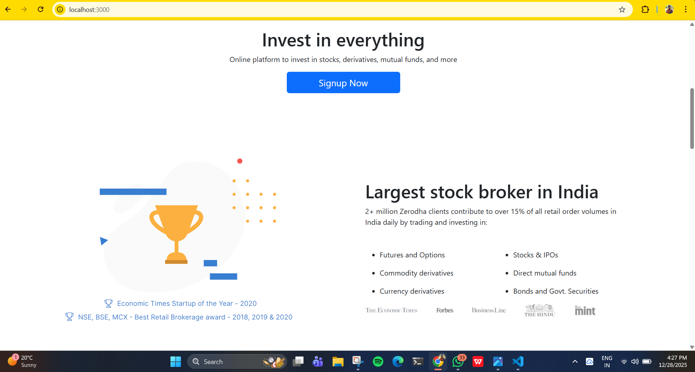
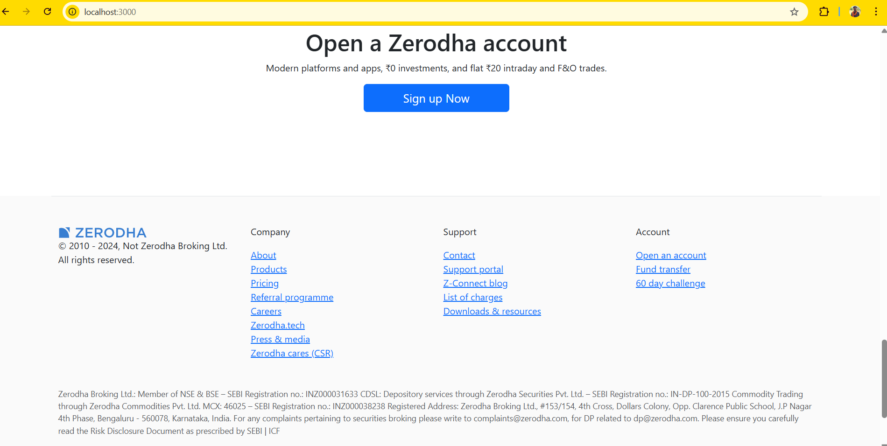

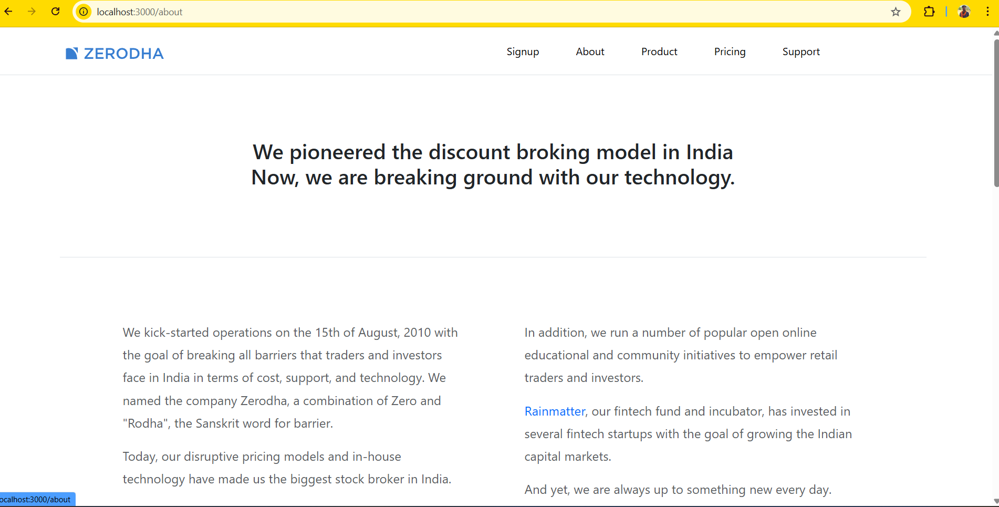
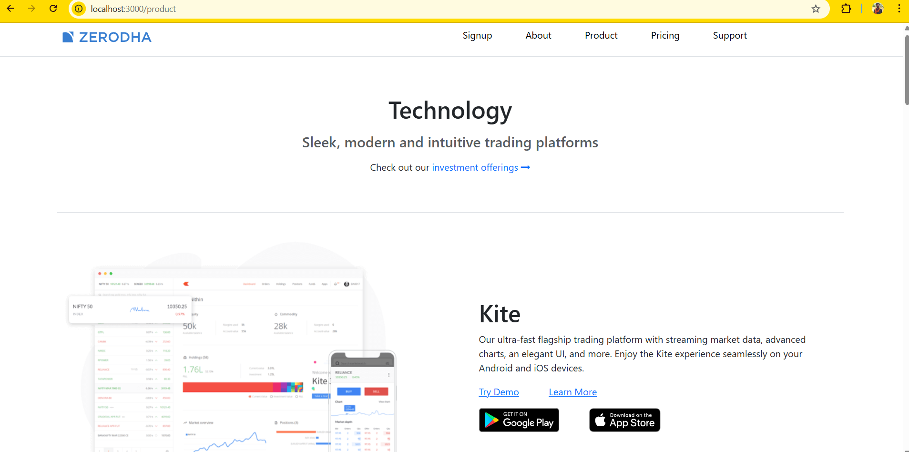
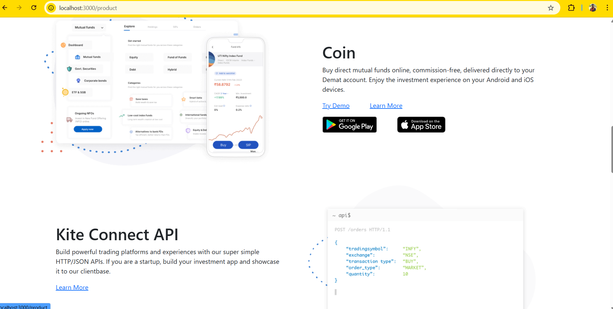
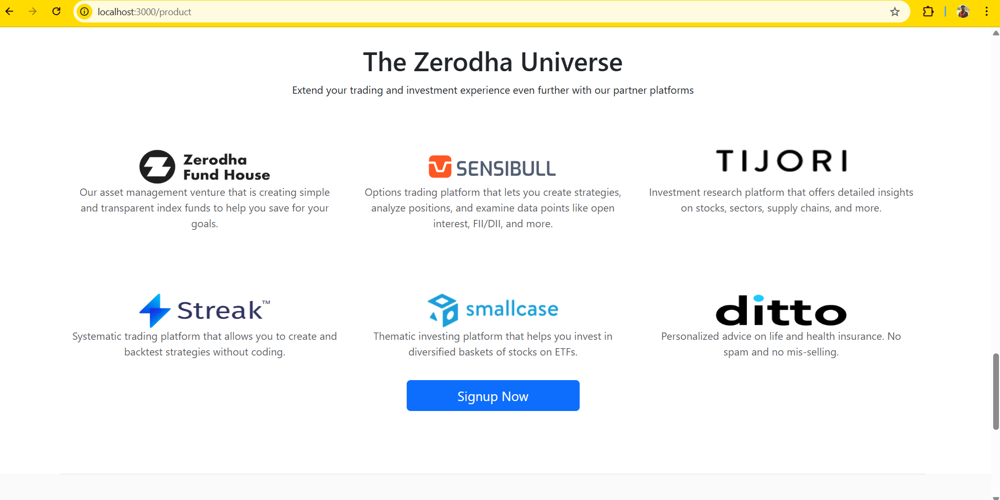
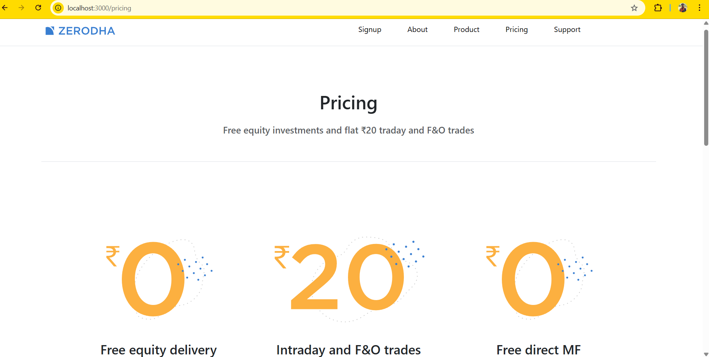
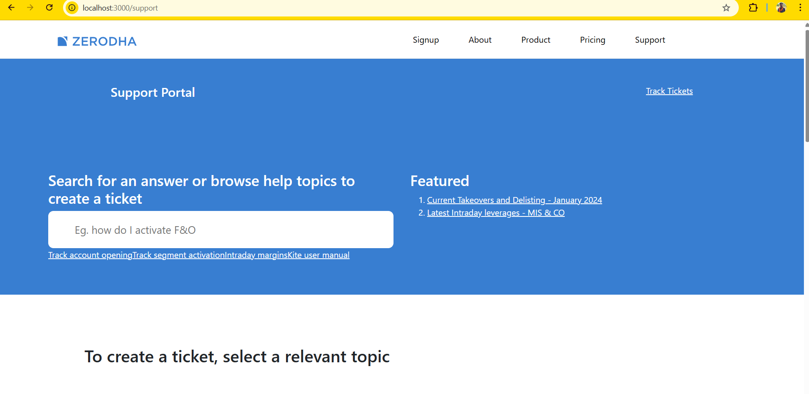
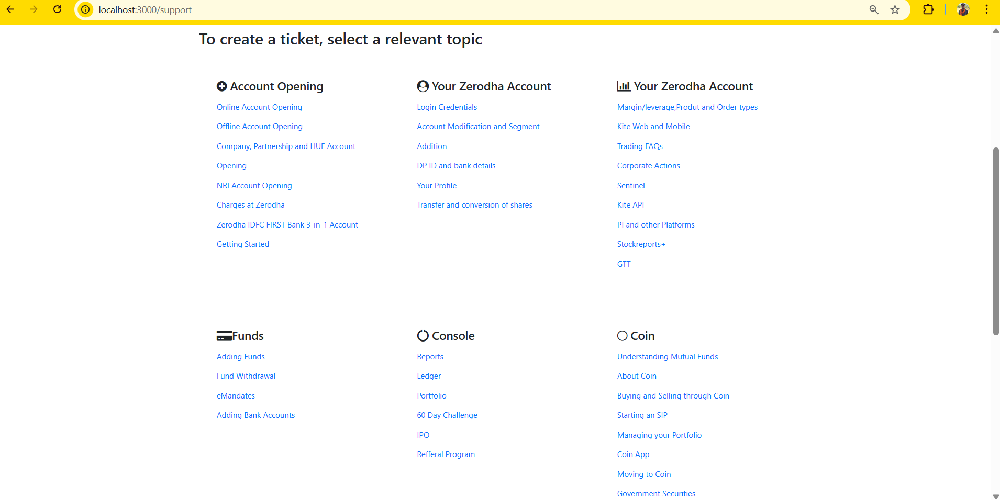
